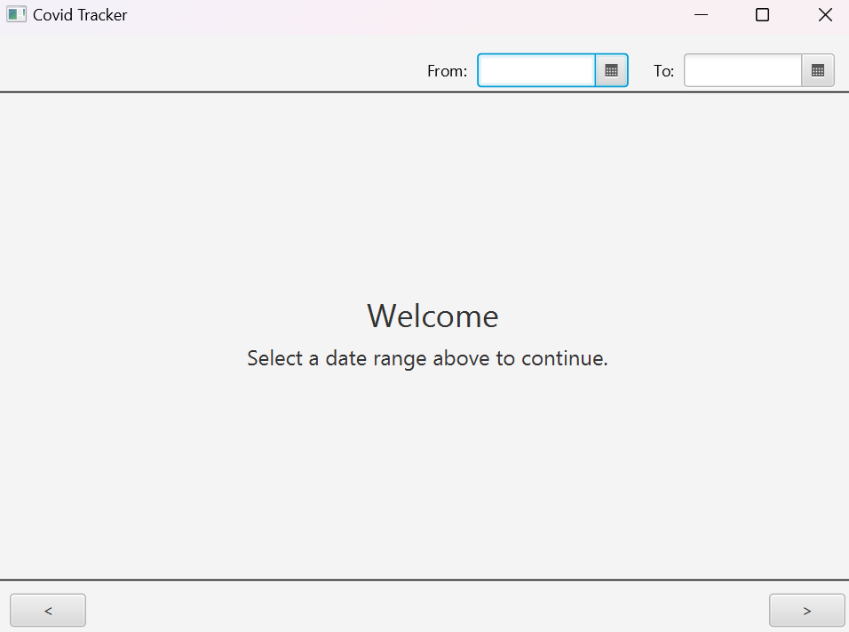
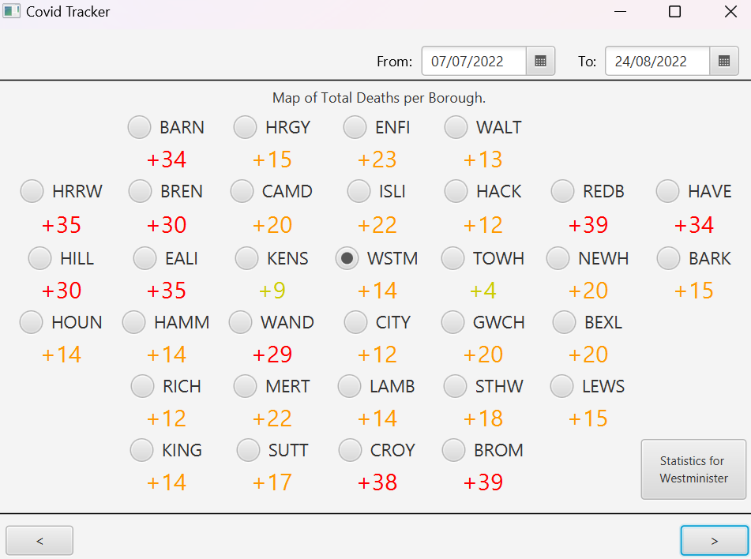
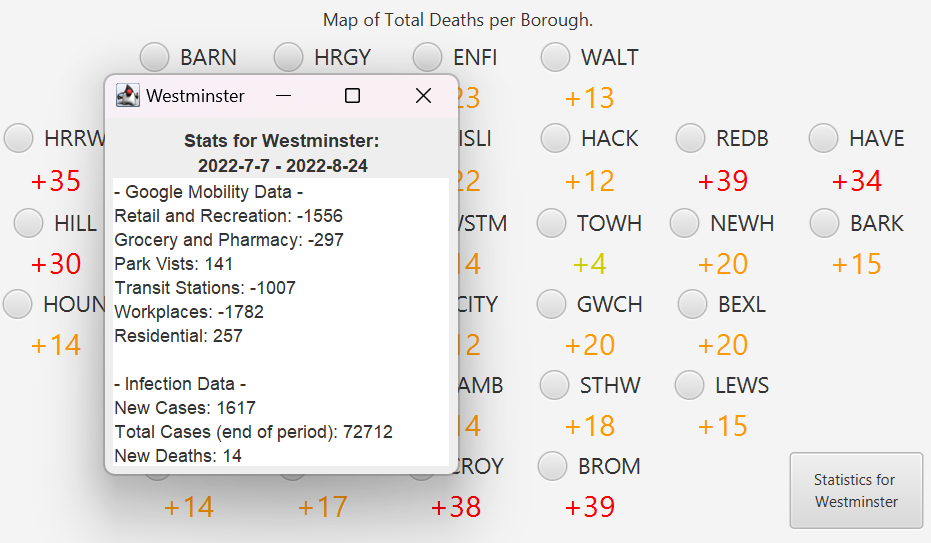
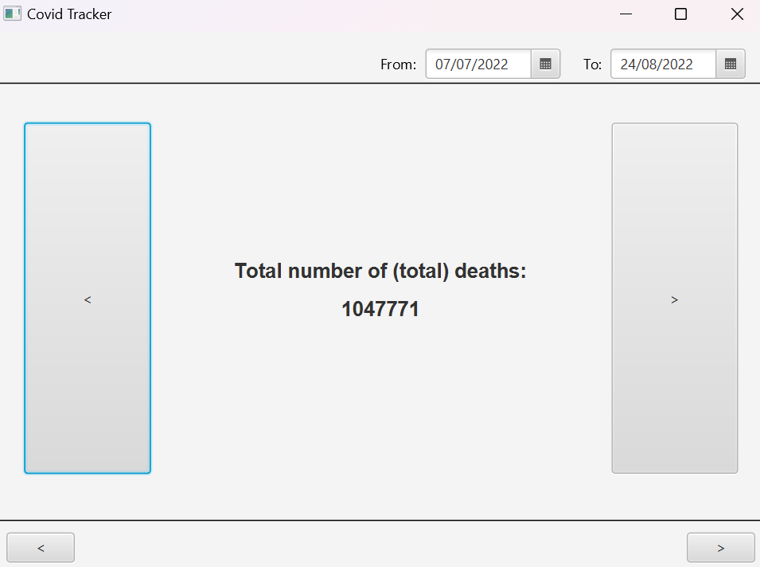
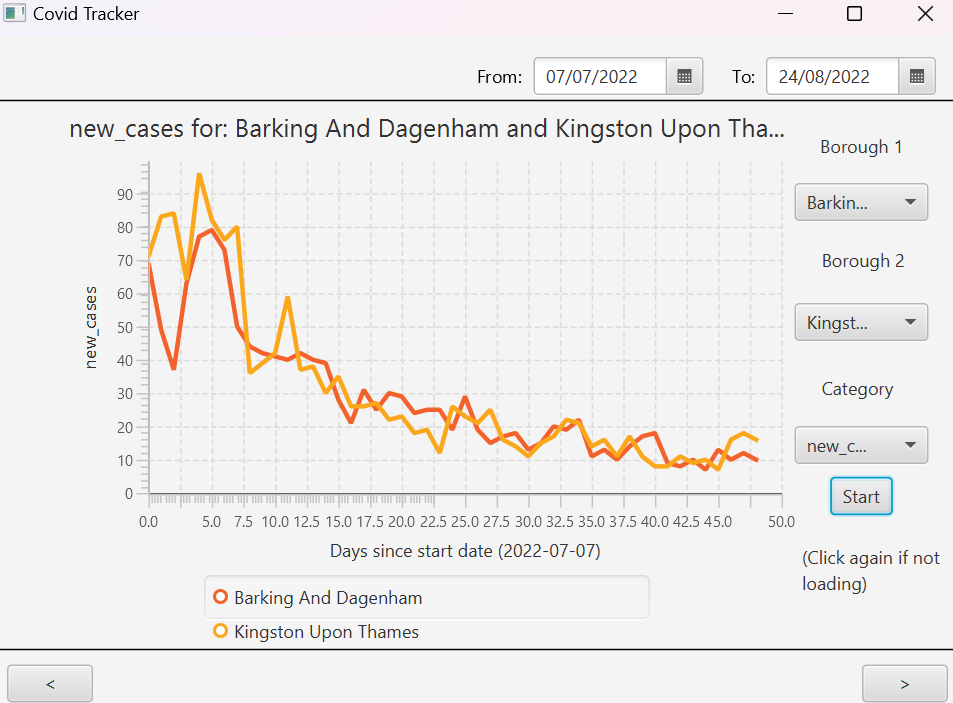

# COVID-19 UK Statistics Interface (Group Project with 3 other people)

## Description
A GUI for processing and displaying statistics for COVID-19 in the UK. 

Uses Java and JavaFX. GUI built using ScreenBuilder.

## Features

- ### Select Date Panel:
  
   

- ### Maps out the distribution:

   

- ### Provides stats for specific areas:

  

- ### Provides overall stats over the time period:

  

- #### Plots stats for two areas on a graph for comparison:

  

## How to use

- JavaFX will need to be installed
- Run the jar file
